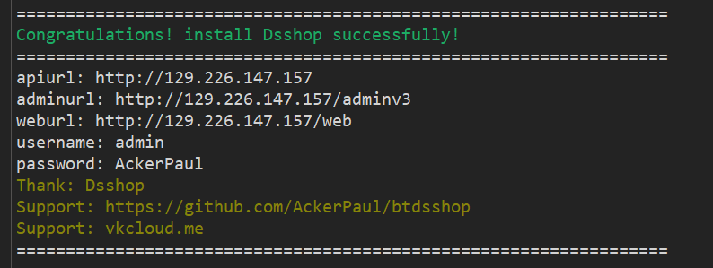
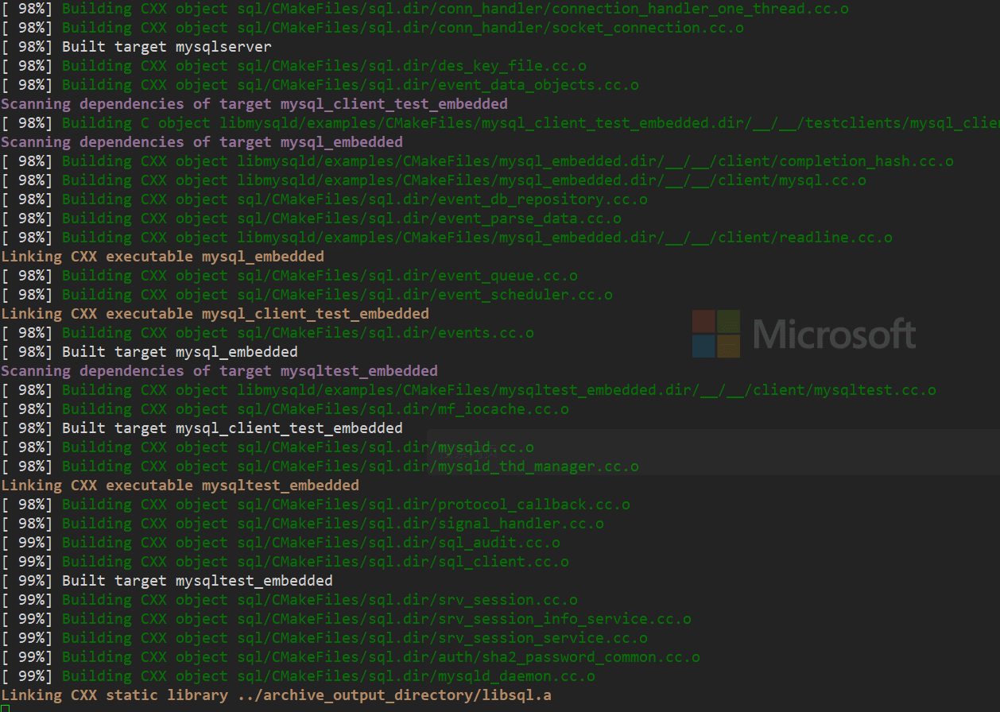
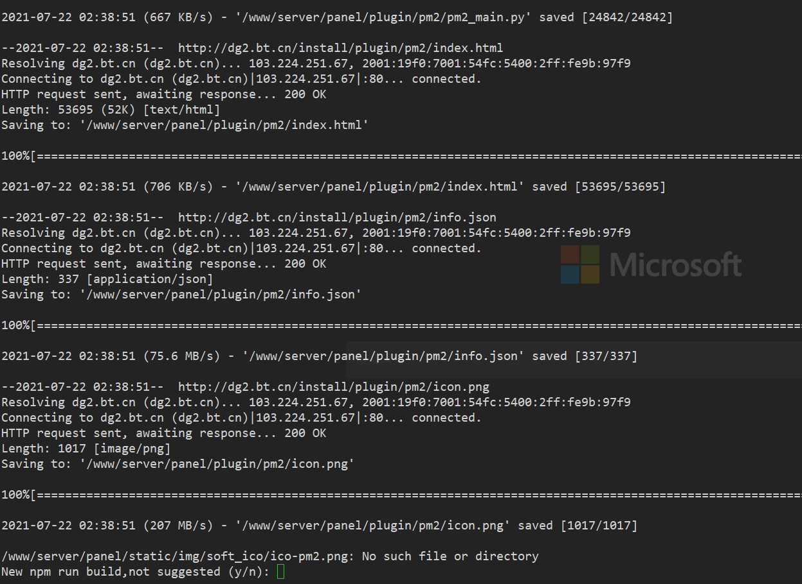
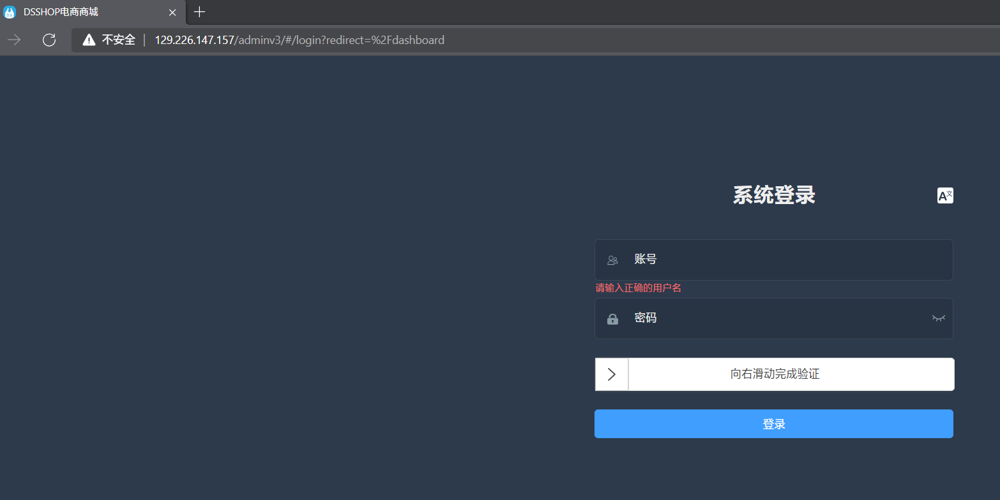

[](https://github.com/AckerPaul/btdsshop)


## Cloud deployment for dsshop
```
wget --no-check-certificate -O /tmp/cloud_deployment.sh https://git.io/JlTT2
chmod +x /tmp/cloud_deployment.sh
bash /tmp/cloud_deployment.sh
```
### Mirroring for dsshop
```
wget --no-check-certificate -O /tmp/cloud_deployment.sh http://download.hanbot.me/dshop/cloud_deployment.sh
chmod +x /tmp/cloud_deployment.sh
bash /tmp/cloud_deployment.sh
```
2个都是一样的/只是分流或者国内机器访问GitHub慢/脚本已做了自动识别是否大陆机器/来分开下载应用压缩包

有什么好玩的项目推给我/我有空加入一键部署

--------------------------------------------------------------------
### Mirroring
全程只需输入一个域名就即可/不用登陆宝塔,没有域名的话/在安装提示输入APP_URL:的时候直接回车即可

| Notification (cloud deployment) | Priority |
| ------------- | ------|
| 自动安装宝塔/跳过必须登陆/跳过授权确认/关闭客服/关闭活动推荐. ☘️  | HIGH :heavy_check_mark: |
| 自动安装nginx/php/mysql/redis/fileinfo. | HIGH :heavy_check_mark: |
| 自动根据输入的APP_URL创建网站数据库/直接回车使用IP为域名. 🥇 | HIGH :heavy_check_mark: |
| 自动开启 laravel php 需要的函数/伪静态/设置public运行目录! | NORMAL :heavy_check_mark: |
| 手动选择是否安装admin静态端/就是编译好打包的/然后替换了接口为你的域名(y/n)! <br /> - 后台账号:admin <br /> - 后台密码:AckerPaul | NORMAL :heavy_check_mark: |
| 手动选择是否重新编译admin端/不懂的请选n (y/n)! | LOW :heavy_check_mark: |
| 手动选择是否编译web端(y/n)! <br /> - 采用静态编译/可能会出现未知问题/为小白提供的 ☘️ 如果出现问题请重新编译 <br /> - cd /www/wwwroot/dsshop-2.2.0/client/nuxt-web/mi <br /> - npm run build <br /> - pm2 start dsshop | LOW :heavy_check_mark: |
| 自动安装宝塔PM2管理器,并且关联了/usr/local/bin/ 可直接在ssh运行npm run build等node命令! | LOW :heavy_check_mark: |
| 使用GitHub API 定时获取dsshop版本/以免您错过最新版本! | LOW :heavy_check_mark: |



以上所有功能都经过验证/并且自动安装前会检测你缺少什么按需安装/项目目前的方向不单单是一键部署dsshop;

后续将实现集群,部署站群部署/平台化让开源作者使用接口部署/以及支持更多的安装较繁琐的程序实现自动化部署;

你的支持就是我的动力.

暂时不考虑上架宝塔插件因为审核较严格;

## look forward to
整合其他好项目等

## Installation screenshot
安装截图





## Related warehouse

- [dsshop](https://github.com/dspurl/dsshop) —  跨平台商城.

## License

[MIT](LICENSE) © Richard Littauer AckerPaul

[](https://github.com/AckerPaul/btdsshop)
